# SM Async Gateway

## Basic concepts

MF SM is very old software. Initally it was developed by Peregrin System as ServiceCenter.
Late HP purchased Peregrin System and rebranded the software as HP ServiceManager.MF purschased HP software business and rename HP ServiceManager to MF ServiceManager.

Only the minor SM kernel changes was made for the last 10 years but the software stil have huge number of installations over the world. It means that the software complyed with customer's requirments for ITIL/ITSM platform.

However, the system integrators whos responcible for integration SM with other applications often got annoing problems.
Initally SM has only a SOAP API. SM's SOAP API is really good but very heavy. A lighweight REST API was added later on as a side dish. User's session is a key point of SM architecture. All the internal functions and procedures extencively use session variables created during the logon procedure.

SM REST API hides session organization from the end-user, but each request requers valid session.  The REST API does't provide session token,that's a bit stange becouse the SOAP API provides. The REST API uses source IP and user name to find idle session. If no session available, it creates new session. There is no way to close session.
SM closes an idle session then idle time exceeds configured timeout period. A timeout period is part of SM application serverlet configuration. It can't be configured for individual session or user.
There are two major problem in this approach:
* all the operations inside the session are syncronus. The session is beasy even if it waits for responce form database. The REST API does not provides any quequeing mechanims. If you have a lot of requests you have a lot of sessions.

* direct relation between number of sessions and number of licenses. One concurent license gives you maximum two sessions (for same IP and user name). In practice  you have to limit number of sessions for integrations to avoid logon denies for GUI users. If you have more than one integration it's a good idea set individual limit of sessions for each integration. The individual limits summary may exceeds total number of sessions reserved for integrations on the assumption that the individal integration doesn't use all available sessions all the time. Howevether, wrong assamptions about integrations activity may affect GUI users.

So, to be good to work with SM's REST API an application should have internal flow control mechanism:

* no more than configured number of requests can placed at one time;
* request should be repeated if SM responded with "to many sessions" error;
* request should be repeated if SM responded with "object busy" error.

It looks not very complex but difenetly aside of modern asyncronous messaging way therefore build it inside the application is a bad idea. A middleware application between SM and the parties is preferable solution even only one application needs to communicate with SM.  

SM Async Gateways (SMAG) is a middleware  provides:

* asynconous communication;
* request queque and flow control configurable per SM user;
* parametric web-hooks.

## Architecture

### Functional modules

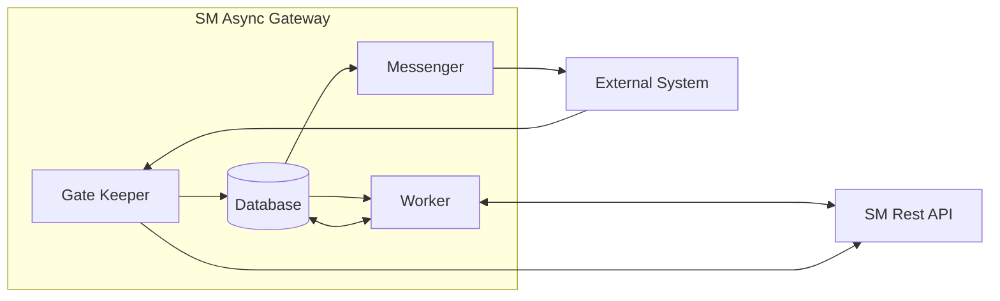

Fig. 1. SMAG functional modules.

**Database** - used as communication channel between modules and store for user authentication cache(see Section User Authentication);
**Gate Keeper (GK)** - recive request from external system, make authentication and authorization, then check correctness of request. Depends on type of request **GK** may execute it (e.g. provide some infromation) or just place into **Database**;
**Worker** - read ready-to-process requests from **Database** and send them to SM via SM Rest API. More than one **Worker** can be configured. Each **Worker** has own responsibility area and number of threads. (see Section Processing Requests);
**Messenger** - read messages from **Database** and send them to **External System**

### Database Structure

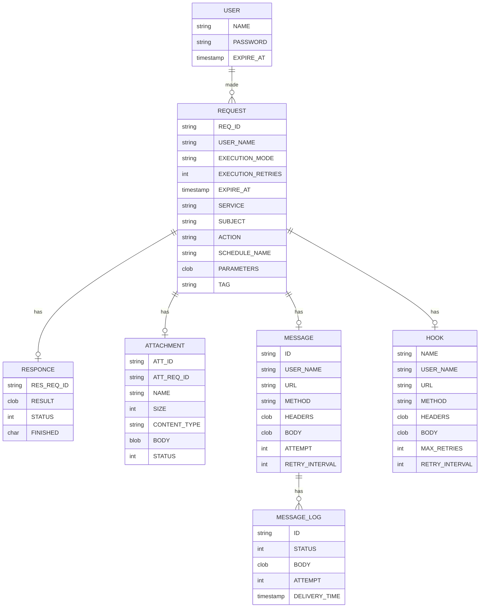
Fig. 2. Database structure.
### Request processing

#### Request authorization procedure

SMAG has only temporary authentication cache. The authentication cache is in-memory structure which store user names and password, as wel as expire time and list of accesible web services. If credentials provied by user not found in the cache or expired, SMAG requests SM for user authentication.
If SM reject request autorization failed. Otherwise SM returns list of web services available for particular user. SMAG updates or creates user's record in the authentication cache. If the service addressed by user's request has no access list no more additional checks requred, otherwise user's list of accessible web service are checked out. If the service is not in the list then autorization failed.

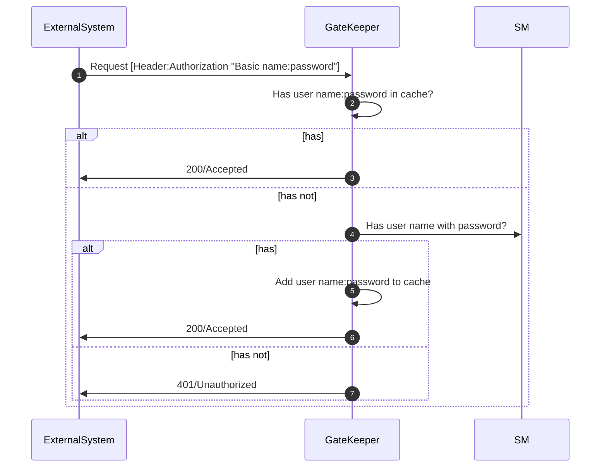

Fig. 3.Authorization sequence.

#### Request types

SMAG supports two types of request:

* Execution request.SMAG passes **execution request** to the SM web-service, specified in request. SM execute requred action immidately and the action result (See [Request execution](#Request-execution) for details).
* Scheduling request. SMAG passes **scheduling request** to special SM web-service, specified in SMAG configuration. SM add request to the execution schedule and execute it late in background mode.(See [Request scheduling](#Request-scheduling) for details).

SMAG distincs requests by **execution_mode** field:

* "I" or not specified for execution requests;
* "S" for scheduling requests.

#### Request execution

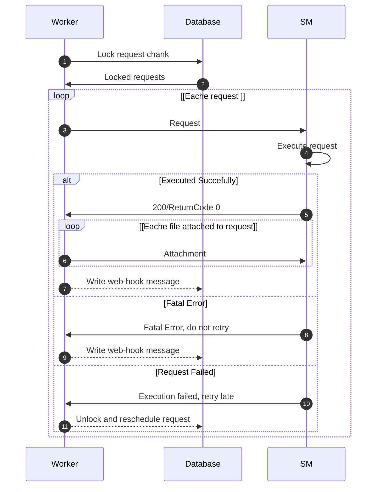

Fig. 4.Request execution sequence.

The execution request URL has form **host:port/SERVICE/SUBJECT/ACTION**, where

* **host:port** is address of SMAG GateKeeper;
* **SERVICE** name of SM REST API collection;
* **SUBJECT** key of collection item;
* **ACTION** name of SM action that must be applied to item.

Worker translate request URL into sm-host:port/sm-base-url/SERVICE/SUBJECT/ACTION, where

* **sm-host:port** adress of SM server,
* **sm-base-url** SM API REST base URL e.g. /SM/9/rest.

Both parameters must be specified in SAM configuration file [sm_async.yml](#sm_async.yml).
If request body contains field **parameters** the field contains is used as body of request to SM. So, it should be valid JSON.

Fields **execution_retries** and **retry_interval** used to rescheduling the request if first attempt are failed.Request will not be rescheduled it maximum number of attempts specified by **execution_retries** exceeded or fatal error occured.

#### Request scheduling

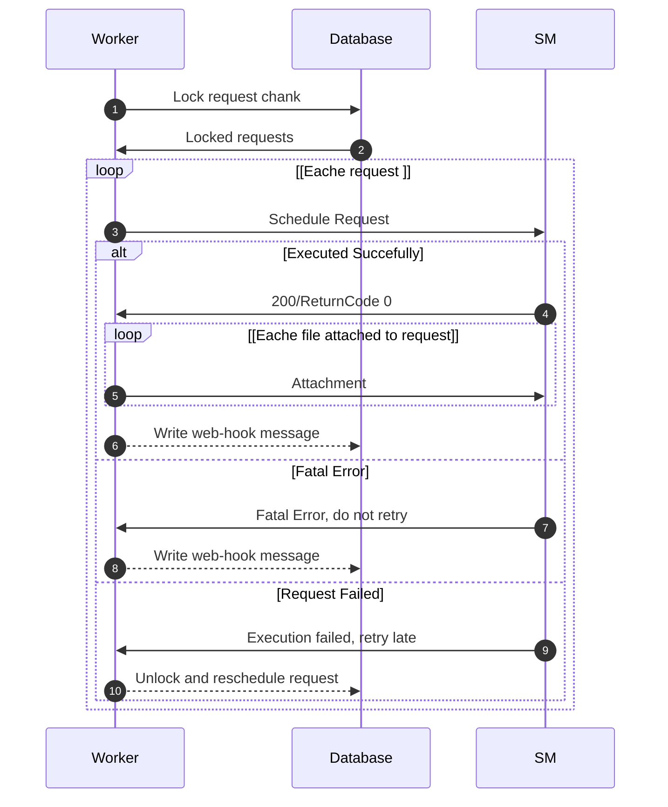

Fig. 5.Request schedule sequence.

The execution request URL has form **host:port/SERVICE/SUBJECT/ACTION**, where

* **host:port** is address of SMAG GateKeeper;
* **SERVICE** name of SM REST API collection;
* **SUBJECT** key of collection item;
* **ACTION** name of SM action that must be applied to item.

Worker translate request URL into sm-host:port/sm-base-url/async, where

* **sm-host:port** adress of SM server,
* **async** name of special SM web-service request scheduling,
* **sm-base-url** SM API REST base URL e.g. /SM/9/rest.

All the parameters must be specified in SAM configuration file [sm_async.yml](#sm_async.yml).
The request body should contains parameters required by request scheduling service:

* **schedule_name** - optional sm scheduler name, if omited default scheduler is used
* **execution_retries** - maximum execution attempts, number optional, defaul value 1;
* **retry_interval** - interval between attempts in seconds;
* **parameters** - optional parametes, stringified JSON

SMAG sends the infromation to SM in the request body:

```JSON
{ userName: <user_name>,
  ticketID: <SUBJECT>,
  request: {
            action: <ACTION>
            parameters: <parameters>,
            execution: {
                         mode: "scheduleOnly"
                         sheduler: <schedule_name>
                         retries: <execution_retries>
                         retiryInterval: <retry_interval>
                         attachmentsCount: <number_of_attached_files>
                       }
            }
}
```

Fields **execution_retries** and **retry_interval** used to rescheduling the request if first attempt are failed.Request will not be rescheduled it maximum number of attempts specified by **execution_retries** exceeded or fatal error occured.

#### Generating messages

SMAG send web-hook message once request executed if it contains message tag.
The message tag is the name of web-hook template used to generate message. There are two kind of templates:

* globaly defined, available for all users,
* user-defined, available only for user who create the template.

User-defined templates have a priority.
A web-hook template includes all the information nessesary to send web-hook message:

* address to delivery message in url form,
* http method (POST or PUT),
* nessesary headers and body defenition,
* maximum number of attemps to delivery and interval between attemps.

Address, headers and body can include tags. The tags are replaced by values of request and responce fields during message generation. The following tags are available:

* **%!%!%BODY%!%!%** - body of SM responce;
* **%!%!%RC%!%!%** - value of ReturnCode field of SM responce);
* **%!%!%MS%!%!%** - value of Messages field of SM responce);
* **%!%!%STATUS%!%!%** - http status of SM responce;
* **%!%!%REQ_ID%!%!%** - SMAG unique request id;
* **%!%!%USER_NAME%!%!%** - user name specfied in request;
* **%!%!%COPY_REPORT%!%!%** - information about attached files copied to SM.

#### Sending messages

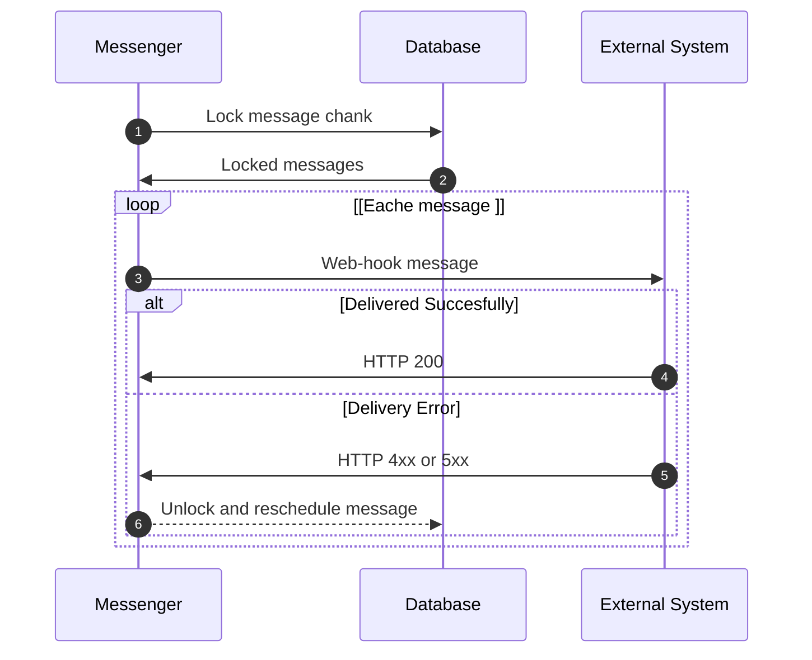

Fig. 6.Message  delivery sequence.

Messenger reads messages writed in database by Worker and tries to make delivery it.
Message includes all the nessesary infromation to handle:

* url of message reciver;
* message body;
* maxim number of attempt to send;
* resend interval.

### Worker Inside

**Worker** can be configured to run in one of the following modes:

* dedicated mode (user mode) - the *Worker* proccesses immediate execution requests placed by users listed in the *Worker*  configuration.  Zero or more dedicated mode *Wrokers* can be configured per SMAG instace;

* global mode  - the *Worker* proccesses immediate execution requests placed by users who have not own dedicated *Worker*. The only one  global mode *Wroker* can be configured per SMAG instace;

* async mode  - the *Worker* proccesses scheduling requests. The only one  async mode *Wroker* can be configured per SMAG instace.

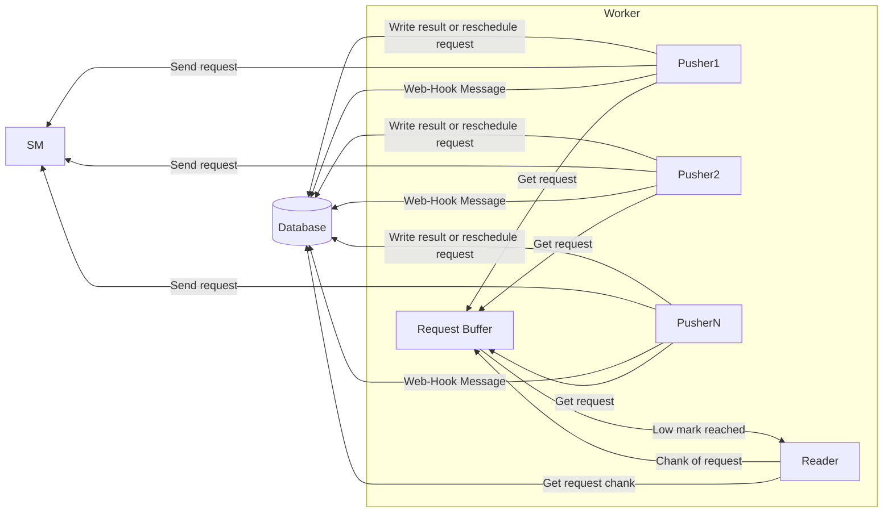

Fig. 7.Worker components.
A Worker consists of the following components:

* **Reader**,
* **Pusher**,
* **Request Buffer**.

*Reader* selects request from database and lock them to avoid of reading by other **Workers**. Number of selected request depends of chank size configuration pramater (See [worker.yml](#worker.yml) for **Workers* configuration parameters). Only requests which are comply ready-to-proccess condition can be selected:

* request has status "N";
* request next run time is earlier than current time;
* limitations applied by **Worker** configuration:
  * for dedicated **Workers**:
    * request excution mode is "I" (immediate execution),
    * only request placed by users listed in the *Worker* configuration can be selected;
  * for global mode  **Worker**:
    * request excution mode is "I" (immediate execution),
    * only request placed by users not listed in the dedicated **Workers** configuration can be selected;
  * for async mode  **Worker**:
    * request excution mode is "S" (scheduling).
The *Reader* places selected request into **Request Buffer**. The **Pushers** take request from the **Request Buffer**. If number of requests in the **Request Buffer** falls bellow configured low-level-mark the **Reader** select more requests from the database and add them to the **Request Buffer**.

The **Pusher**  send request to SM server. If the request processed succesfully the **Pusher**:

* writes SM resonce as a result of request into the database;
* copies files attached to the request to SM server.  

In case of error  the **Pusher** unlock the request and reschedule by changing its parameters:

* number of attemps is increased by 1;
* value of next run is increaded by value of retry interval.

However, if the error treats as fatal or number of attemps is equal to ther value of execution retry parameter the **Pusher** writes error responce into the database and stops father request proccessing.

   Table 1.Responce matrix.
   |HTTP status    | SM ReturnCode |   SM Message     | Action |
   | --------------| ----------| --------------------| -------|
   |OK 200         |  0 | ANY | Write result and copy attachments    |
   |OK 200         | not 0 | ANY | Reschedule    |
   |Unathorized 401|  -4| 'Not Authorized' | Write error | NOT-ATHORIZED  |
   |Unathorized 401|  -4| not 'Not Authorized'| Retry, if number of retries exicided then reschedule |
   |Unathorized 401| not -4 | ANY | Write error |
   |Not-Found   404| 9| ANY | Write error |
   |Not-Found   404| not 9| ANY | Retry, if number of retries exicided then reschedule |
   |Not-Found   404| nil | ANY | Retry, if number of retries exicided then reschedule |
   |Bad-Request 400| ANY | ANY | Write error |
   |Not-Found   500| -4| ANY | Reschedule |
   |Not-Found   500| not -4 | ANY | Write error |
   |ANY OTHER      | ANY | ANY | Write error |

If the **Pusher** finished the request processing (does not matter succefully or not ) and the request has web-hook tag, the **Pusher** reads select web-hook template by tag, uses it to create web-hook message and writes the message into the database.

More than one **Pusher** can be configured for a **Worker**. All the **Pushers** work in parralel which means more **Pushers** - more semaltenios SM sessions. To avoid performance issues number of configured **pushers** must comply total number of SM session reserved for integration as well as individaul session configuration for users which SMAG uses to place request to SM.

 Dedicated mode **Workers's**  **Pushers** use user-provided credentials to places request, in async mode all the request are placed with credential specfied in [worker.yml](#worker.yml) configuration file. Global mode behavior depends on **global-mode-user** parameter value:

* "masked" - use credentials specified in the configuration file;
* "asis" - use user-provided credentials.
The **Worker** generates less sessions if "masked" but at cost of droping information about user who placed request.

### Messenger Inside

**Messenger** can be configured to run in one of the following modes:

* dedicated mode (user mode) - the **Worker** proccesses immediate execution requests placed by users listed in the *Worker*  configuration.  Zero or more dedicated mode *Wrokers* can be configured per SMAG instace;

* global mode  - the **Worker** proccesses immediate execution requests placed by users who have not own dedicated *Worker*. The only one  global mode **Wroker** can be configured per SMAG instace.

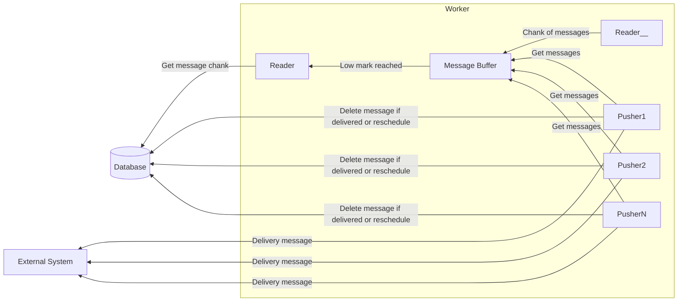

Fig. 8.Worker components.
A **Worker** consists of the following components:

* **Reader**,
* **Pusher**,
* **Message Buffer**.

The **Reader** selects messages from the database and locks them to avoid of reading by other **Messengers**. Number of selected messagers depends of chank size configuration pramater (See [messenger.yml](#messenger.yml) for **Messengers* configuration parameters). Only messages comply with ready-to-proccess condition can be selected:

* message next run time is earlier than current time;
* limitations applied by **Messengers** configuration:
  * for dedicated **Messengers**:
    * only messages are generated by processing requests placed by users listed in the *Messenger* configuration can be selected;
  * for global mode  **Messenger**:
    * only rmessages are generated by processing requests placed by users not listed in the dedicated **Messengers** configuration can be selected.

The *Reader* places selected messages into **Message Buffer**. The **Pushers** take messages from the **Message Buffer**. If number of messagers in the **Message Buffer** falls bellow configured low-level-mark the **Reader** select more messages from the database and add them to the **Message Buffer**.

The **Pusher**  send message to the external system according to URL specfied in the message. If the message delivered  succesfully (http status 200) the **Pusher** deletes the message from the database.
In case of error  the **Pusher** unlocks the message and reschedules by changing its parameters:

* number of attemps is increased by 1;
* value of next run is increaded by value of retry interval.

However, if number of attemps is equal to ther value of execution retry parameter the **Pusher** deletes the message from the database.

More than one **Pusher** can be configured for a **Messenger**. All the **Pushers** work in parralel which means more **Pushers** - more web-hook messages can be delivered to the external system semalteniosly. To avoid performance issues make sure that the external system can handle generated message flow.

## Installation

### Installation options

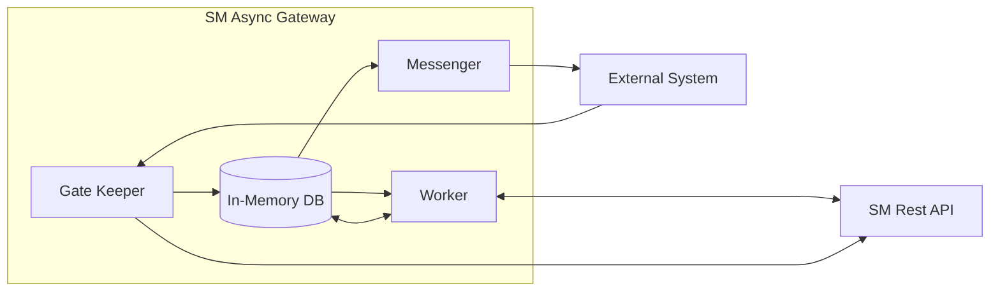

Fig. 1. SMAG compact installation

Compact installation is useful for test or small environment. All functional modules as well as database engine work inside one java process. Only H2 database can be used in compact installation. H2 database can be configured as in-memory database or file-based to run database engine in same java environment.
Compact installation with in-memory database has minimal delay between placing request to SMAG and delivery it SM. So, if you really care about such a delay several compact installation working in parrallel may be a good option. However, if requests with large attachments are expected in-memory database is not recommeded option.
File-base option is not recommended for production. If in-memory database doesn't fit productive installation requerments SMAG standart installation is preferable option.

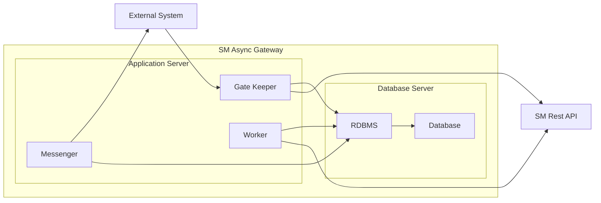

Fig. 9.SMAG standart installation.

Standart installation suiteable in most cases. All the SMAG processes run in one java envoronment and communicates with database via tcp connection. RDBMS server may share sever with SMAG or started on other server.

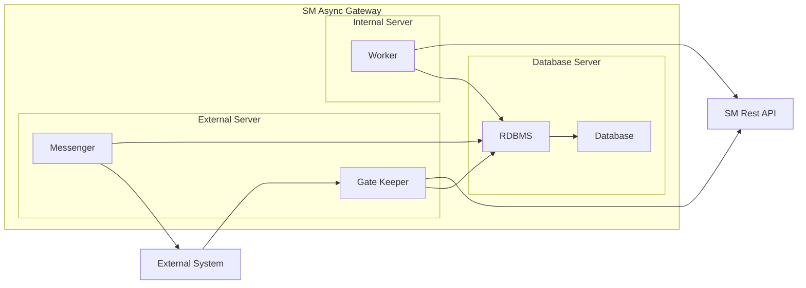

Fig. 10.SMAG secured installation.

SMAG modules can be splited between servers. It may worth doing that for security reason. At Fig. modules, accessible for external system located on separate server and have limited capability to communicate with SM - only GateKeeper module has access SM to make authorization. It means access to the dedicated SM web service. Other communication between External Server and SM can be easyly blocked by firewall.

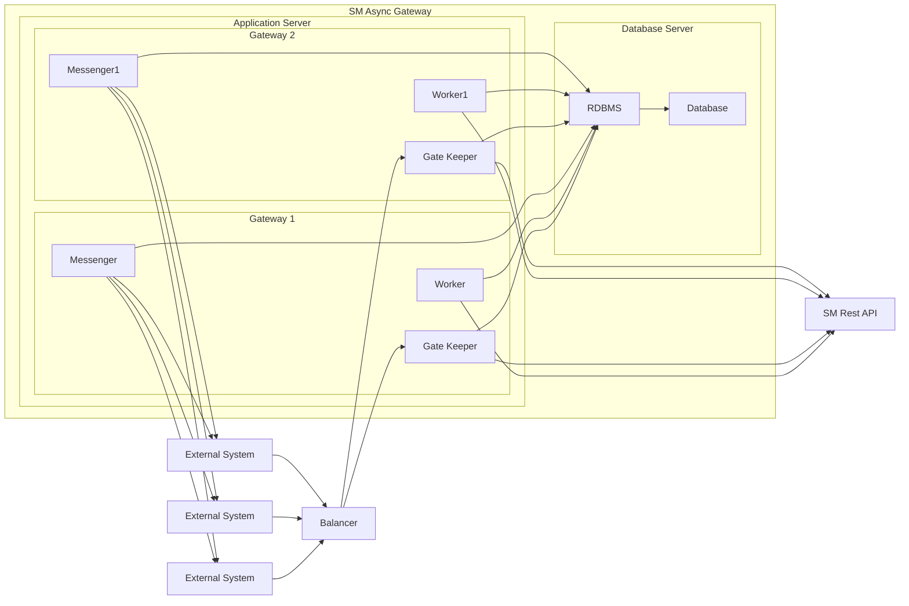

Fig. 11.SMAG vertical scalability.

SMAG performance may be increased by running several instance on one server. Each instance should have own configuration catalog with proper set of configuration files. Make sure that instance use different ports.
Horizontal scalability also supported.

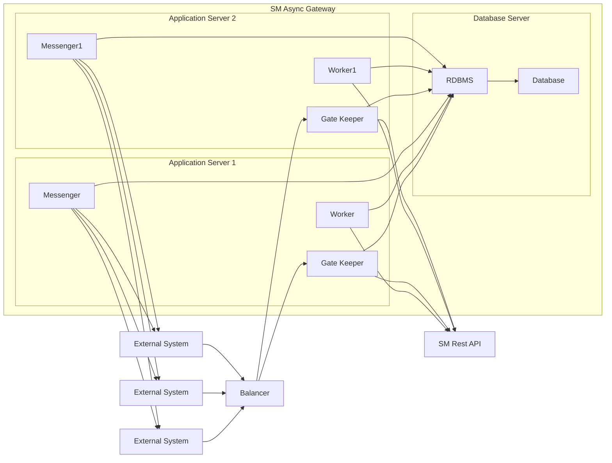

Fig. 12. SMAG horizontal scalability.

Each instance may be confgured to have own database, but it looks impractical. Each instance may by configured to work with particular instance of SM application server. It may be usefull if you have several instance of SM application servers without balancer.
If all the instance work with same database simple round-robin balancer good enouth for distribute external requests between instances.
Besudes perfomance resons multyinstance configuration can be fine tuned for sepcific needs, e.g. having dedicated gateway for important or having specila requirments external system.

### Prerequisites

### Installing Async Gateway

### Configure SM to work with Async Gateway

## Usage

### Run Async Gateway

FIXME: explanation

    java -jar sm-async-api-0.1.0-standalone.jar [args]

### Web-hooks operation

Pay attention: a user can create, modify or delete only his own hooks.
The Hooks, created by other users, does not available for modification or preview/test run operations.
The Hooks, created by the administrator,  available for review/test run operations only.

#### Register or Update web-hook

_COMMAND:_ PUT
_URL:_ /Hook
_HEADERS:_
Content-Type: application/json
Authentication: Basic name:password

_BODY:_
Body should be correct JSON contains the following field:

* **name**  - web-hook name
* **url** -   message delivery address, url-encoded string
* **method** - HTTP method of the message, string, possible values: _post_, _put_, _get_, default value is _post_
* **headers** - json contains the message's headers
* **body** -  the message's body
* **max_retries**  - number of attempts to make delivery, number, possible values: >0 and < 200, default value is  _1_
* **retry_interval** - interval is seconds, number,  possible values: >10 , default value is _11_

Values of fields url, headers and body may include tags. The tags are replaced by values of request and responce fields during message generation. The following tags are available:

* _%!%!%BODY%!%!%_ - body of SM responce;
* _%!%!%RC%!%!%_- value of ReturnCode field of SM responce);
* _%!%!%MS%!%!%_ - value of Messages field of SM responce);
* _%!%!%STATUS%!%!%_ - http status of SM responce;
* _%!%!%REQ_ID%!%!%_ - SMAG unique request id;
* _%!%!%USER_NAME%!%!%_ - user name specfied in request;
* _%!%!%COPY_REPORT%!%!%_ - information about attached files copied to SM.

#### Get web-hook by its name

_COMMAND:_ GET
_URL:_ /Hook/<HOOK_NAME>
_HEADERS:_
Content-Type: application/json
Authentication: Basic name:password

* <HOOK_NAME> - name of the hook

#### Delete web-hook

_COMMAND:_ DELETE
_URL:_ /Hook/<HOOK_NAME>
_HEADERS:_
Content-Type: application/json
Authentication: Basic name:password

* <HOOK_NAME> - name of the hook.

#### Message preview

The operation returns json conains message fields values (url, headers, body, method) generated based on specified web-hook name and expected SM responce.

_COMMAND:_ GET
_URL:_ /Hook/<HOOK_NAME>/preview
_HEADERS:_
Content-Type: application/json
Authentication: Basic name:password

_BODY:_
Body is used to provide expected SM responce. It should be correct JSON contains the following field:

* **responce** - expected responce body. Note:It's worth to include in responce  SM's two special fields:
  * **RetrunCode** - number, request result code, 0 if success;
  * **Messages** - array of strings, may includes error description or messages for requestor.
* **responce_status** - expected HTTP status of responce.

#### Test run

The operation runs web-hook execution:

* generate a message based on based on specified web-hook name and expected SM responce;
* add message to the messenger queue;
* delivery message according to the messenger configuration and the message attributes.

_COMMAND:_ GET
_URL:_ /Hook/<HOOK_NAME>/preview
_HEADERS:_
Content-Type: application/json
Authentication: Basic name:password

_BODY:_
Body is used to provide expected SM responce. It should be correct JSON contains the following field:

* **responce** - expected responce body. Note:It's worth to include in responce  SM's two special fields:
  * **RetrunCode** - number, request result code, 0 if success;
  * **Messages** - array of strings, may includes error description or messages for requestor.
* **responce_status** - expected HTTP status of responce.

### Requests operations

#### Create request

_COMMAND:_ POST
_URL:_
/<SERVICE_NAME>/<OBJECT_ID>/\<ACTION>

* <SERVICE_NAME> - name of collection configured in SM and presented via configuration file (see Section [sm_async.yml](#sm_async.yml) in [Configuration files and parameters](#Configuration_files_and_parameters) );
* <OBJECT_ID> - unique key for item of collection <SERVICE_NAME>, only single key collection are supporterd so far;
* \<ACTION> - action to be applied to the item. Note: special action **get**, which return item as a result, can be enabled in workers.yml see Section workers.yml in Configuration files and parameters );

_HEADERS:_
Content-Type: application/json
Authentication: Basic name:password

_BODY:_
Body should be correct JSON contains the following field:

* execution_mode - string, optional. Define way of proccessing action by the gateway. Possible values:
  * I - requested action must by proccessed by SM REST API;
  * IS - ?;
  * S - requested action must be processed by SM Async Service (see Section SM Asyc Service).
* schedule_name - shedule name, string optional, use in conjunction with execution_mod = "S"
* execution_retries - maximum execution attempts, number optional, defaul value 1;
* retry_interval - interval between attempts in seconds;
* parameters - optional parametes, stringified JSON, used as:
  * body of request if execution_mode "I"
  * value of parameters field if execution_mode "S"
* status - string, optional, default value "N". Possible values:
  * N - process request asap;
  * W - wait till for run request (see Section ), usefull if you need attach files to request;
* tag - name of web-hook template, string, optional (see Section Web hooks).

_RESULT:_
JSON contains:

* rec_id - unique id of request, string;
* ReturnCode - error code,number, if OK 0;
* Messages - array of strings, error messages.

### Attach file to request

_COMMAND:_ POST
_URL:_
/Action/<REC_ID>/attachment

* <REC_ID> - unique id of request

_HEADERS:_
Authentication: Basic name:password
Content-Type: \<depends of attachment type>
Content-Disposition: attachment;filename\*=UTF-8''\<filename>
Content-Length: \<attachment length>

_RESULT:_
JSON contains:

* href - unique id of attached file, string;
* ReturnCode - error code,number, if OK 0;
* Messages - array of strings, error messages.

### Run request

Run previosly created request. Request should have status "W" (see Create request).
_COMMAND:_ POST
_URL:_
/Action/<REC_ID>/run

* <REC_ID> - unique id of request

_HEADERS:_
Authentication: Basic name:password

_RESULT:_
JSON contains:

* ReturnCode - error code,number, if OK 0;
* Messages - array of strings, error messages.

### Cancel request

Cancel previosly created request. Request should have status "W" (see Create request).
Once canceled request can not be run any more.
_COMMAND:_ POST
_URL:_
/Action/<REC_ID>/run

* <REC_ID> - unique id of request

_HEADERS:_
Authentication: Basic name:password

_RESULT:_
JSON contains:

* ReturnCode - error code,number, if OK 0;
* Messages - array of strings, error messages.

### Get attachments list

Get result list of files attached to the request
_COMMAND:_ GET
_URL:_
/Action/<REC_ID>/attachments

* <REC_ID> - unique id of request

_HEADERS:_
Authentication: Basic name:password

_RESULT:_
JSON contains:

* ReturnCode - error code,number, if OK 0;
* Messages - array of strings, error messages.

### Get attachment

Download file attached to request
_COMMAND:_ GET
_URL:_
/Action/<REC_ID>/<ATTACHMED_ID>

* <REC_ID> - unique id of request
* <ATTACHMED_ID> - unique id of attachment

_HEADERS:_
Authentication: Basic name:password

_RESULT:_
JSON contains:

* ReturnCode - error code,number, if OK 0;
* Messages - array of strings, error messages.

### Get result

Get result of processing request by SM. The result available only for request with execution*mode="I".
\_COMMAND:* GET
_URL:_
/Action/<REC_ID>/result

* <REC_ID> - unique id of request

_HEADERS:_
Authentication: Basic name:password

_RESULT:_
JSON contains:

* ReturnCode - error code,number, if OK 0;
* Messages - array of strings, error messages.

## Options

### Configuration files and parameters

#### sm_async.yml

Manadatory configuration file, contains basic gateway parameters

* **module_ip: hostname** - sm application server hostname and port
* **login: user-name** - login/password used to connect to sm server for configuration needs
* **password: password** - password will be revomed from configuration file during startup, cifered and stored in keystore.yml
* **async-gateway-id: UID** - moldule id, must be unique for eache node if clustered configuration are used
* **async-gateway-port: port-number** - port number for client access
* **collections: collections-list** - list of collections presented via gateway. Each list item includes:

  * **name: collection-name** - name of collection, provided by sm and accessible via gateway
  * **acl: true/false** - if true, accesslist configured on sm side should be applyed during authorization
  * **keylist: [ FieldName1, FieldName1]** - array of field names which formes unique key

* **max-att-size: file-size** - limit for attachment files size, bytes
* **max-total-att-size: number-of-files** - limit for number of files attached to one request, if 0 - no limits
* **mime-types: [MimeType1, MimeType2]** - list of supported mime-types
* **to-many-threads-sleep: duration** - waiting period in ms, used to pause before retry if sm server replyed with Too-Many-Threads error
* **server-not-availalbe-sleep: duration** - waiting period in ms, used to pause before retry if sm sever not available
* **async-pusher-enabled: true/false** - set up sync or async network communication between sm and gateway, change only if you understed perfectly what you are going to do
* **async-action-keys: [ ActionID ]** - array of field names which formes unique key for sm async request api, see Section SM Request API for detais
* **write-intermidiate-result: true/false** - if true async gateway saves in db results of unsuccesful attempts to execute request, otherwiest only last attempt saves. Default false.
* **poll-enabled: true/false** - run poll sever, which allows sm polls requests from gateway, see Section Gateway Configuration Options for more information
* **poll-port: port-number** - port for poll sever

#### worker.yml

Manadatory configuration file, contains parameters for push workers, whos pushing requests from gateway to sm, see Section Gateway Configuration Options for more information

* **dedicated-enabled: true/false** - enable workers dedicated for specific user or user groups
* **dedicated-get-allowed: true/false** - enable get request for dedicated workers
* **dedicated: workers-list** - list worker, each item contains parameters requered by worker to start
* **name: user-name/[user-name1, user-name2]** - user name or array of user names whos are served by the worker
* **threads: number-of-threads** - number of request which worker allowed to place to sm server simultaneously
* **chank-size: number-of-request** - number of request read from db and buffered before send by worker
* **global-enabled: true/false** - enable global worker to serve all user having not dedicated worker
* **global-mode-user: masked/asis** - in masked mode worker send request to sm using global credentials, otherwise user credentials
* **global-login: login** - login/password used to communicate with sm server by global worker in masked mode
* **global-password: password** - password will be revomed from configuration file during startup, cifered and stored in keystore.
* **global-threads: number-of-threads** - number of request which global worker allowed to place to sm server simultaneously
* **global-chank-size: number-of-request** - number of request read from db and buffered before send by global worker
* **async-enabled: true/false** - enable "asyc" worker to communicate with sm async request api
* **async-login: login** - login/password used to communicate with sm async request api
* **async-password: password** - password will be revomed from configuration file during startup, cifered and stored in keystore.
* **async-threads: number-of-threads** - number of request which "asyc" worker allowed to place to sm server simultaneously
* **async-chank-size: number-of-request** - number of request read from db and buffered before send by "asyc" worker

#### db.yml

Manadatory configuration file, contains database connectivity parameters

* **db-type: type** - type of database, supported types are h2, oracle, postgersql
* **db-host: host** - database server host and port numbe
* **db-name: name** - database name
* **db-login: login** - login/password used to communicate with database
* **db-password: password** - password will be revomed from configuration file during startup, cifered and stored in keystore.
* **db-schema: schema** - datbase schema name
* **h2-protocol: tcp/mem/file** - h2 specific parameter:
  * **tcp** - file stored database, h2 engine runs separately and communicate with gateway using tcp
  * **mem** - in memory database, h2 engine attached directly to gateway process
  * **file** - file stored database, h2 engine attached directly to gateway process
* **h2-path** - database file location, make sence if h2-protocol:file only
* **db-message-log** - enable/disable logging for web-hook message delivery into MESSAGE_LOG database table. Possible values: enable or disable. I

#### messengers.yml

Manadatory configuration file, contains database connectivity parameters:

Manadatory configuration file, contains parameters for messengers, whos send message after request processed, see Section Gateway Configuration Options for more information

* **dedicated-enabled: true/false** - enable messengers dedicated for specific user or user groups
* **dedicated: workers-list** - list messengers, each item contains parameters requered by worker to start
* **name: user-name/[user-name1, user-name2]** - user name or array of user names whos are served by the worker
* **threads: number-of-threads** - number of messages which messenger allowed to send simultaneously
* **chank-size: number-of-request** - number of messages read from db and buffered before send by messenger
* **global-enabled: true/false** - enable global messenger to server all user having not dedicated messenger
* **global-threads: number-of-threads** - number of request which global messenger allowed to send simultaneously
* **global-chank-size: number-of-request** - number of request read from db and buffered before send by global worker

#### globals.yml

Optional configuration file, allows set values for global varalble. If file missing hardcoded defauls are used.

* **new-task-waiting: duration** - idle time between examining database for new tasls and messages by workers and messagers
* **max-retry-waiting: duration** - maximum idle time between retries for workers (if sm reply To-many-threads), real idle time is random duration between 0 and maximum idle time
* **max-retry-waiting: duration** - idle time before next attemp in case worker or messanger got communication error
* **max-retry-count: number-of-attemp** - maximum number of attemp for:
  * copy attachment to sm server - if excided copy failed
  * push request to sm - if excided push resheduled as it specified in request
* **attachment-copy-mode: fast/slow** - in fast mode all files attached to request retrived from database by one select then send, otherwise files retrived and send one by one

## Examples

## License

Copyright © 2021 FIXME

This program and the accompanying materials are made available under the
terms of the Eclipse Public License 2.0 which is available at
<http://www.eclipse.org/legal/epl-2.0>.

This Source Code may also be made available under the following Secondary
Licenses when the conditions for such availability set forth in the Eclipse
Public License, v. 2.0 are satisfied: GNU General Public License as published by
the Free Software Foundation, either version 2 of the License, or (at your
option) any later version, with the GNU Classpath Exception which is available
at <https://www.gnu.org/software/classpath/license.html>.

